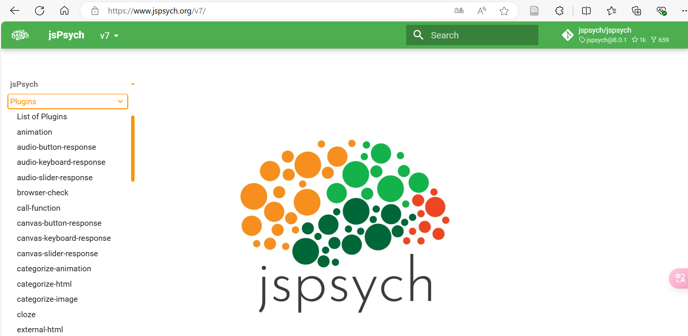
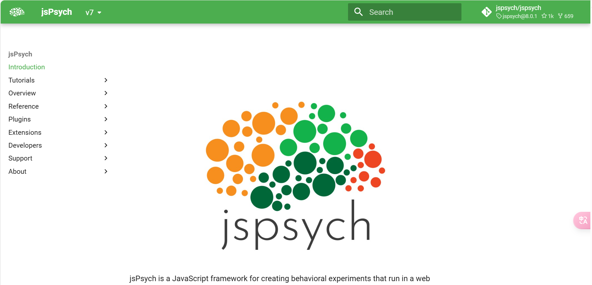
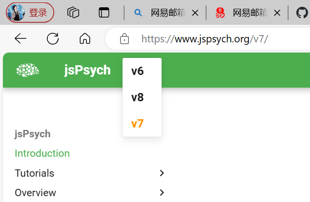
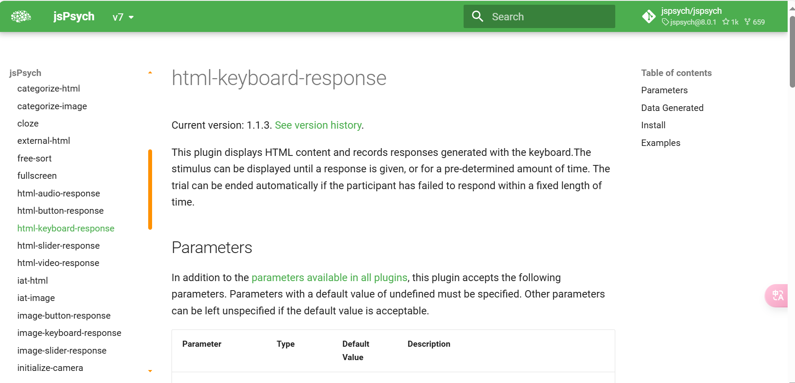
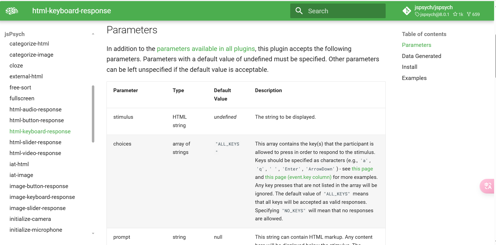
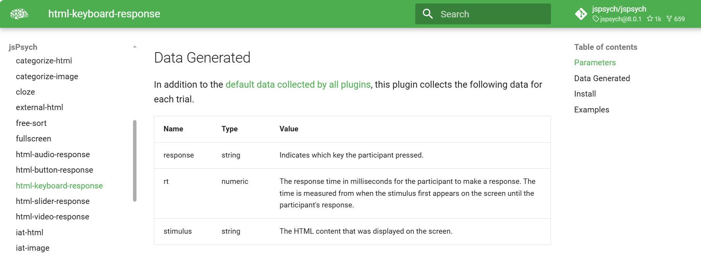
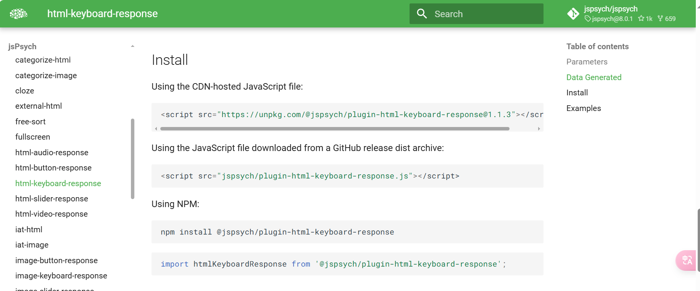
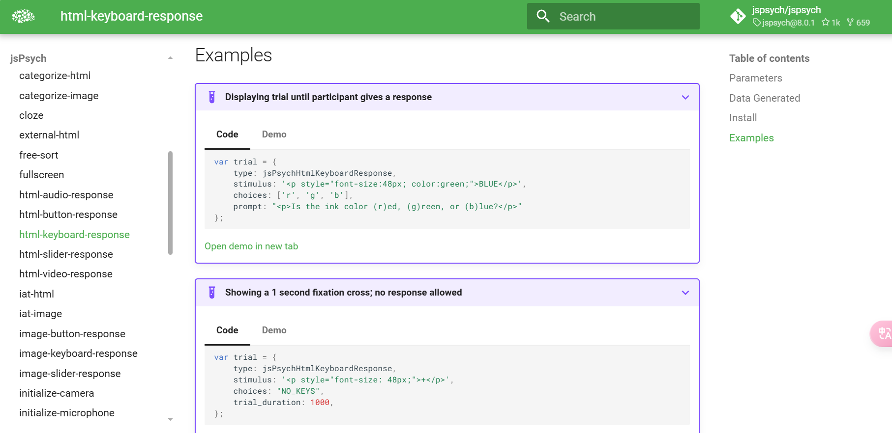
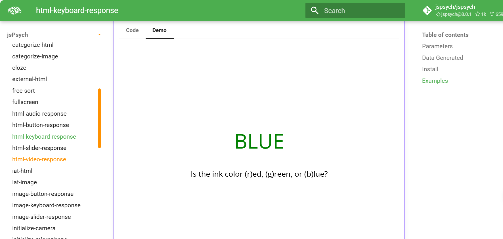

# jsPsych 实验设计教程

## 简介

本教程将引导你使用 jsPsych 创建一个包含两部分任务的实验：计算任务和放松任务。目标是使不熟悉 jsPsych 的读者也能按照教程步骤完成实验设计。

## 基础准备

### 1. 基本的 HTML、CSS 和 JavaScript 知识

- **HTML**：超文本标记语言 (HTML) 是用来构建网页内容的骨架。可以通过 [W3school-HTML](https://www.w3schools.com/html/default.asp) 的教程开始学习。
- **CSS**：层叠样式表 (CSS) 用于设置网页内容的样式。可以通过 [W3school-CSS](https://www.w3schools.com/css/default.asp) 的教程开始学习。
- **JavaScript**：JavaScript 是一种编程语言，用于网页的交互功能。可以通过 [W3school-JavaScript Tutorial](https://www.w3schools.com/js/default.asp) 的教程开始学习。

### 2. 能够使用文本编辑器

文本编辑器是用来编写和编辑代码的工具。以下是几个常用的文本编辑器：

- **VSCode**：微软的 Visual Studio Code 是一个免费的开源代码编辑器。下载地址：[VSCode 下载](https://code.visualstudio.com/Download)
- **Sublime Text**：一个轻量级且功能强大的代码编辑器。下载地址：[Sublime Text 下载](https://www.sublimetext.com/download)

### 3. 可以访问互联网以下载 jsPsych 库及其插件

为了运行 jsPsych 实验，你需要从互联网上下载相关的库和插件。可以通过以下步骤完成：

- **打开文本编辑器**：如 VSCode 或 Sublime Text。
- **创建项目文件夹**：在你的电脑上创建一个新的文件夹，用于存放实验文件。
- **jsPsych 库**：建议直接访问 jsPsych 官网获取最新信息和代码。你可以在 jsPsych 的 [官方文档](https://www.jspsych.org/) 中如下图位置找到所有插件的详细说明和使用示例。


## 详细介绍

### 基本HTML标签

HTML 标签可以分为开始标签和结束标签。大多数 HTML 标签都需要一对标签来定义内容的开始和结束，比如 `<p>` 和 `</p>`，但有些标签是自闭合的，比如 ``。

以下是一些常见的 HTML 标签及其用法：

```html
<!DOCTYPE html> <!-- 声明文档类型为HTML5 -->
<html lang="en"> <!-- 定义HTML文档的根元素，并设置语言为英语 -->
<head> <!-- 包含文档的元数据，通常包含标题、字符集声明、样式和脚本等 -->
  <meta charset="UTF-8"> <!-- 声明文档使用的字符编码为UTF-8 -->
  <meta name="viewport" content="width=device-width, initial-scale=1.0"> <!-- 设置视口，用于响应式设计 -->
  <title>页面标题</title> <!-- 定义文档的标题，显示在浏览器标签栏中 -->
</head>
<body> <!-- 定义文档的主体内容 -->
  <h1>一级标题</h1> <!-- 定义一个一级标题，通常用于页面的主标题 -->
  <p>这是一个段落。</p> <!-- 定义一个段落 -->
  <a href="https://example.com">点击这里</a> <!-- 定义一个超链接，点击后跳转到指定URL -->
   <!-- 定义一个图像，src属性指定图像文件的位置，alt属性提供图像的替代文字 -->
</body>
</html>
```

在上面的示例中：

- `<!DOCTYPE html>` 声明文档类型为 HTML5，帮助浏览器正确解析和显示文档。
- `<html lang="en">` 标签定义了文档的根元素，并设置了文档的语言属性为英语。
- `<head>` 标签包含了文档的元数据，这些数据不会显示在网页上，但对网页显示有重要影响。
- `<meta charset="UTF-8">` 标签声明了文档的字符编码，使用 UTF-8 编码可以确保文本在所有浏览器中正确显示。
- `<meta name="viewport" content="width=device-width, initial-scale=1.0">` 标签用于设置视口，以实现响应式设计，使网页在不同设备上有更好的表现。
- `<title>` 标签定义了文档的标题，该标题会显示在浏览器的标签栏中。
- `<body>` 标签定义了文档的主体内容，所有在网页上显示的内容都应该放在这个标签内。
- `<h1>` 标签用于定义一个一级标题，通常用于页面的主标题。
- `<p>` 标签用于定义一个段落。
- `<a href="https://example.com">` 标签用于定义一个超链接，点击后会跳转到指定的 URL。
- `` 标签用于定义一个图像，`src` 属性指定图像文件的位置，`alt` 属性提供图像的替代文字。

这些基本标签是构建 HTML 文档的基础，了解它们的用法和意义是学习 HTML 的第一步。

### 在线服务器（html文件）

为了简化开发流程，你可以使用 jsPsych 提供的在线服务器来加载插件，而无需下载到本地。只需在你的 HTML 文件中引用相关的插件 URL 即可。这些插件用于不同类型的实验任务和功能，下面详细介绍每个插件的用途以及如何在官网查询它们的使用方法。

```html
<script src="https://unpkg.com/@jspsych/plugin-html-keyboard-response@1.1.3"></script>
<script src="https://unpkg.com/@jspsych/plugin-html-button-response@1.2.0"></script>
<script src="https://unpkg.com/@jspsych/plugin-survey-text@1.1.3"></script>
<script src="https://unpkg.com/@jspsych/plugin-audio-button-response@1.2.0"></script>
<script src="https://unpkg.com/@jspsych/plugin-instructions@1.1.4"></script>
<script src="https://unpkg.com/@jspsych/plugin-preload@1.1.3"></script>
<script src="https://unpkg.com/@jspsych/plugin-html-slider-response@1.1.3"></script>
<script src="https://cdnjs.cloudflare.com/ajax/libs/xlsx/0.17.0/xlsx.full.min.js"></script>
```

### 插件介绍

1. **plugin-html-keyboard-response**:允许在屏幕上显示 HTML 内容并记录用户的键盘响应。
2. **plugin-html-button-response**:显示 HTML 内容并记录用户点击按钮的响应。
3. **plugin-survey-text**:创建文本调查，允许用户输入文本回答。
4. **plugin-audio-button-response**:播放音频并记录用户点击按钮的响应。
5. **plugin-instructions**:显示一系列指令页面，用户可以通过点击按钮导航。
6. **plugin-preload**:预加载实验中使用的媒体文件（如图像、音频）。
7. **plugin-html-slider-response**:显示 HTML 内容并记录用户在滑块上的选择。
8. **xlsx**:用于读取和处理 Excel 文件的库。

### 如何查询插件的使用方法

以 `plugin-html-keyboard-response` 插件为例，以下是如何在 jsPsych 官网查询插件的使用方法：

1. **访问官网**: 打开 [jsPsych 官网](https://www.jspsych.org/)。

2. **选择版本**: 在文档页面选择你正在使用的 jsPsych 版本。

3. **查找插件**: 在文档中找到 "Plugins" 部分，然后找到 `html-keyboard-response` 插件。

4. **查看参数信息**: 点击 `html-keyboard-response` 插件的链接，在parameters部分可以查看插件的详细参数设置，依次是参数名称、参数类型、默认值、描述。

5. **查看输出数据信息**:在Data Generate部分可以查看插件的输出数据情况，依次是名称、类型、价值。

6. **查看导入信息**:在Install部分可以查看插件的导入代码，直接复制粘贴进HTML文件中即可。

7. **查看示例**:在Examples部分可以查看插件示例Code是代码部分，而demo是演示。



通过这种方法，你可以轻松查找并理解每个 jsPsych 插件的具体用法，确保你的实验设计符合预期。

### HTML文档简化

在构建 jsPsych 实验时，为了避免 HTML 文件过长和结构混乱，我们可以将文件拆分为 HTML、CSS 和 JavaScript 三个部分。

#### 示例

假设我们有以下文件结构：

```bash
/project-folder
├── index.html
├── styles.css
└── script.js
```

HTML文件：`index.html`

```html
<!DOCTYPE html>
<html lang="en">
<head>
    <meta charset="UTF-8">
    <meta name="viewport" content="width=device-width, initial-scale=1.0">
    <title>集中&放松实验</title>
    <link rel="stylesheet" href="styles.css">
</head>
<body>
    <div class="task-container">
        <p>您好，欢迎参加本次实验。</p>
        <p>如果您准备好了，点击下面的按钮开始。</p>
        <button id="start-button">开始</button>
    </div>
    <script src="script.js"></script>
</body>
</html>
```

CSS 文件：`styles.css`

```css
body, html {
    margin: 0;
    padding: 0;
    width: 100%;
    height: 100%;
    font-family: Arial, sans-serif;
    display: flex;
    justify-content: center;
    align-items: center;
    background-color: #f0f0f0;
}

.task-container {
    display: flex;
    flex-direction: column;
    justify-content: center;
    align-items: center;
    width: 80%;
    max-width: 600px;
    padding: 20px;
    background-color: white;
    border-radius: 10px;
    text-align: center;
}
```

JavaScript 文件：`script.js`

```js
document.getElementById('start-button').addEventListener('click', function() {
    alert('实验开始！');
});
```

#### JavaScript 文件的作用


JavaScript 是一种用于实现网页动态行为的脚本语言。通过 JavaScript，可以增强网页的交互性和功能性。

以下是一个 Markdown 格式的教程，详细解释了每一段代码的功能和逻辑，并展示了如何将这些代码片段结合在一起：

---

## jsPsych 实验教程

本教程将指导你如何使用 `jsPsych` 进行实验设计，包括如何初始化 `jsPsych`、创建任务、添加到时间线以及导出数据。

### 1. 初始化 jsPsych

```javascript
// 初始化 jsPsych
var jsPsych = initJsPsych({
    on_finish: function() {
        // 实验结束时导出数据为 Excel 文件
        exportDataToExcel();
    }
});
```

- `initJsPsych()` 函数用于初始化 `jsPsych` 实例。
- `on_finish` 回调函数在实验完成时被调用，调用 `exportDataToExcel()` 函数以导出实验数据为 Excel 文件。

### 2. 创建时间线数组

```javascript
// 创建时间线数组
var timeline = [];
```

- `timeline` 是一个空数组，用于存储实验的任务。任务将按照添加的顺序依次执行。

### 3. 输入被试编号的任务

```javascript
// 输入被试编号的任务
var subject_id = {
    type: jsPsychSurveyText,
    questions: [
        {prompt: "请输入您的编号：", name: 'subject_id', required: true}
    ],
    on_finish: function(data) {
        try {
            // 尝试解析被试编号
            var responses = data.responses ? JSON.parse(data.responses) : {};
            jsPsych.data.addProperties({
                subject_id: responses.subject_id || 'undefined'
            });
        } catch (e) {
            // 解析失败时输出错误信息
            console.error("Error parsing responses:", e);
        }
    }
};
// 将被试编号任务添加到时间线
timeline.push(subject_id);
```

- 该任务使用 `jsPsychSurveyText` 插件来收集被试编号。
- `on_finish` 回调在任务完成后执行，将被试编号添加到 `jsPsych` 数据中。
- `timeline.push(subject_id)` 将任务添加到时间线。

### 4. 欢迎页面任务

```javascript
// 欢迎页面任务
var welcome = {
    type: jsPsychHtmlButtonResponse,
    stimulus: '<div class="task-container">' +
              '<p>您好，欢迎参加本次实验。</p>' +
              '<p>接下来你会看到两类任务：</p>' +
              '<p>第一类：计算任务，计算出具体答案后用鼠标选择正确的选项，只允许选一次，选择后立即下一题。</p>' +
              '<p>第二类：放松任务，周围会放出缓慢的音乐，优美的图片，您只需要让自己放松下来即可。</p>' +
              '<p>如果您准备好了，点击下面的按钮开始。</p>' +
              '</div>',
    choices: ['开始']
};
// 将欢迎页面任务添加到时间线
timeline.push(welcome);
```

- 该任务使用 `jsPsychHtmlButtonResponse` 插件展示欢迎页面。
- `stimulus` 包含 HTML 内容，介绍实验的两部分任务。
- `choices` 是一个按钮，用户点击后继续到下一个任务。

### 5. 生成数学题

```javascript
// 生成数学题
function generateMathProblem() {
    var types = ['+', '-', '*', '/'];
    var type = types[getRandomInt(0, types.length - 1)];
    var num1, num2, answer;

    if (type === '+') {
        num1 = getRandomInt(1, 1000);
        num2 = getRandomInt(1, 1000);
        answer = num1 + num2;
    } else if (type === '-') {
        num1 = getRandomInt(1, 1000);
        num2 = getRandomInt(1, num1);
        answer = num1 - num2;
    } else if (type === '*') {
        num1 = getRandomInt(1, 100);
        num2 = getRandomInt(1, 100);
        answer = num1 * num2;
    } else {
        num1 = getRandomInt(1, 100);
        num2 = getRandomInt(1, 100);
        answer = num1 * num2;
        num1 = answer;
        answer = num1 / num2;
    }

    return { question: `${num1} ${type} ${num2} = ?`, answer: answer };
}
```

- `generateMathProblem()` 函数生成随机数学题。
- 根据运算符选择随机数，并计算答案。

### 6. 创建数学题任务

```javascript
// 创建数学题任务
function createMathTrial() {
    var problem = generateMathProblem();
    var options = [problem.answer, problem.answer + 1, problem.answer - 1, problem.answer + 2];
    options = jsPsych.randomization.shuffle(options);

    return {
        type: jsPsychHtmlButtonResponse,
        stimulus: `<div class="task-container"><p>${problem.question}</p></div>`,
        choices: options.map(option => option.toString()),
        data: {
            task: 'math',
            correct_answer: problem.answer
        },
        on_finish: function(data) {
            // 检查回答是否正确
            data.correct = data.response == options.indexOf(problem.answer.toString());
            data.rt = data.rt;
        }
    };
}
```

- `createMathTrial()` 函数生成数学题任务。
- 选择问题答案的选项并打乱顺序。
- `on_finish` 回调用于验证回答是否正确。

### 7. 创建放松任务

```javascript
// 创建放松任务
function createRelaxTrial() {
    return {
        type: jsPsychHtmlButtonResponse,
        stimulus: '<div class="task-container"><p>放松任务</p><video width="100%" height="100%" controls autoplay><source src="video.MP4" type="video/mp4">您的浏览器不支持视频播放。</video></div>',
        choices: ['结束任务'], // 添加结束任务按钮
        button_html: '<button class="jspsych-btn">%choice%</button>',
        on_finish: function(data) {
            var video = document.querySelector('video');
            if (video) {
                video.pause();
            }
        }
    };
}
```

- `createRelaxTrial()` 函数创建放松任务，包括视频播放。
- `on_finish` 回调在任务完成时暂停视频播放。

### 8. 创建练习块

```javascript
// 创建练习块
function createPracticeBlock() {
    var practice_trials = [];
    for (var i = 0; i < 5; i++) {
        practice_trials.push(createMathTrial());
    }

    var instructions_practice = {
        type: jsPsychHtmlButtonResponse,
        stimulus: '<div class="task-container">' +
                  '<p>接下来将开始计算题练习</p>' +
                  '<p>请在保证准确性的前提下尽可能加快速度</p>' +
                  '<p>如果您准备好了，点击下面的按钮开始。</p>' +
                  '</div>',
        choices: ['开始']
    };

    var end_practice = {
        type: jsPsychHtmlButtonResponse,
        stimulus: '<div class="task-container">' +
                  '<p>练习结束</p>' +
                  '<p>如果您准备好正式实验，点击下面的按钮开始。</p>' +
                  '</div>',
        choices: ['开始']
    };

    return [instructions_practice, ...practice_trials, end_practice];
}
// 将练习块任务添加到时间线
timeline.push(...createPracticeBlock());
```

- `createPracticeBlock()` 函数创建包含练习题的任务块。
- 包括练习说明、5个数学题和练习结束任务。
- 将练习块添加到时间线。

### 9. 正式实验说明任务

```javascript
// 正式实验说明任务
var instructions_real = {
    type: jsPsychHtmlButtonResponse,
    stimulus: '<div class="task-container">' +
                '<p>正式实验开始</p>' +
                '<p>如果您准备好正式实验，点击下面的按钮开始。</p>' +
                '</div>',
    choices: ['开始']
};
// 将正式实验说明任务添加到时间线
timeline.push(instructions_real);
```

- `instructions_real` 提供实验开始的说明。
- 添加到时间线以供正式实验开始前显示。

### 10. 创建正式实验任务

```javascript
// 创建正式实验任务
var real_trials = [];
for (var i = 0; i < 50; i++) {
    real_trials.push(createMathTrial());
}
// 将正式实验任务添加到时间线
timeline.push(...real_trials);
```

- 创建50个数学题任务并将它们添加到时间线。

### 11. 添加任务切换说明

```javascript
// 添加任务切换说明
timeline.push({
    type: jsPsychHtmlButtonResponse,
    stimulus: '<div class="task-container">' +
                '<p>任务一结束</p>' +
                '<p>接下来进行任务二：放松任务</p>' +
                '<p>您只需要尽可能地放松、发呆</p>' +
                '<p>沉浸在轻松的氛围中即可</p>' +
                '</div>',
    choices:

 ['开始']
});
```

- 在数学任务结束后添加放松任务的说明。

### 12. 将放松任务添加到时间线

```javascript
// 将放松任务添加到时间线
timeline.push(createRelaxTrial());
```

- 将放松任务添加到时间线以供实验进行。

### 13. 添加脑电安全帽舒适度评分任务

```javascript
// 添加脑电安全帽舒适度评分任务
timeline.push({
    type: jsPsychHtmlSliderResponse,
    stimulus:'<div class="task-container">' +
        '<p>请您对脑电安全帽的舒适度进行评分：</p>' +
        '<p>1:非常不舒服,10:非常舒服;</p>' +
        '</div>',
    labels: [1,2,3,4,5,6,7,8,9,10],
    step:1,
    min:1,
    max:10,
    slider_start:5,
    slider_width:500,
    require_movement: true,
    button_label:'确认提交'
});
```

- 使用 `jsPsychHtmlSliderResponse` 插件创建评分任务。
- 允许被试对舒适度进行评分。

### 14. 实验结束页面任务

```javascript
// 实验结束页面任务
timeline.push({
    type: jsPsychHtmlButtonResponse,
    stimulus: '<div class="task-container">' +
              '<p>实验已结束，感谢您的参与！</p>' +
              '</div>',
    choices: ['结束']
});
```

- 显示实验结束页面，感谢参与者。

### 15. 导出数据为 Excel 文件的函数

```javascript
// 导出数据为 Excel 文件的函数
function exportDataToExcel() {
    var data = jsPsych.data.get().json();
    var jsonData = JSON.parse(data);
    
    // 转换数据为 Excel 格式
    var worksheet = XLSX.utils.json_to_sheet(jsonData);
    var workbook = XLSX.utils.book_new();
    XLSX.utils.book_append_sheet(workbook, worksheet, "实验数据");

    // 生成 Excel 文件
    var excelData = XLSX.write(workbook, { bookType: 'xlsx', type: 'array' });

    // 创建下载链接并点击
    var blob = new Blob([excelData], { type: 'application/octet-stream' });
    var url = URL.createObjectURL(blob);
    var a = document.createElement('a');
    a.href = url;
    a.download = '实验数据.xlsx';
    a.click();
    URL.revokeObjectURL(url);
}
```

- `exportDataToExcel()` 函数将 `jsPsych` 数据转换为 Excel 格式并生成下载链接。

### 16. 启动实验

```javascript
// 启动实验
jsPsych.run(timeline);
```

- 使用 `jsPsych.run()` 启动实验并按照时间线顺序执行任务。

---
通过上述步骤，你可以创建一个完整的心理学实验，涵盖数学题任务、放松任务、练习块、正式实验、任务切换以及数据导出功能。


### CSS文件

#### CSS 文件的作用

CSS（层叠样式表）用于描述 HTML 文档的样式。它负责控制网页的布局、颜色、字体等，使网页更具视觉吸引力和用户友好性。

#### 弹性盒子（Flexbox）

弹性盒子（Flexbox）是 CSS3 中的一种布局模式，它可以使复杂的布局结构变得更加简单和灵活。Flexbox 布局通过将容器的子元素按行或列对齐和分布，可以轻松实现各种常见的布局需求，例如居中对齐、等宽排列等。

#### 示例

下面是对CSS文件每一段代码的详细讲解，包括每段代码的作用和内部逻辑。

```css
/* 重置一些默认样式 */
body, html {
    margin: 0; /* 去除默认外边距 */
    padding: 0; /* 去除默认内边距 */
    width: 100%; /* 设置宽度为100% */
    height: 100%; /* 设置高度为100% */
    font-family: Arial, sans-serif; /* 设置字体为Arial，若不支持则使用sans-serif */
    display: flex; /* 使用Flex布局 */
    justify-content: center; /* 水平居中 */
    align-items: center; /* 垂直居中 */
    background-color: #f0f0f0; /* 设置背景颜色 */
}
```

### 解释：
- **body, html**: 重置HTML和body的默认样式，使页面元素在不同浏览器中表现一致。
- **margin**: 去除外边距。
- **padding**: 去除内边距。
- **width, height**: 设置宽高为100%，使页面占满整个视口。
- **font-family**: 设置默认字体。
- **display: flex**: 使用Flex布局，方便子元素的对齐和分布。
- **justify-content: center**: 子元素在主轴（水平）方向居中。
- **align-items: center**: 子元素在交叉轴（垂直）方向居中。
- **background-color**: 设置背景颜色为浅灰色。

```css
/* 整个body的Flex容器 */
body {
    display: flex; /* 使用Flex布局 */
    justify-content: center; /* 水平居中 */
    align-items: center; /* 垂直居中 */
}
```

### 解释：
- **body**: 再次定义Flex布局，用于对齐body内的所有内容，使其水平和垂直居中。

```css
/* 样式化 jsPsych HTML Button Response 的刺激部分 */
#jspsych-html-button-response-stimulus {
    display: flex; /* 使用Flex布局 */
    justify-content: center; /* 水平居中 */
    align-items: center; /* 垂直居中 */
    box-sizing: border-box; /* 包括内边距和边框 */
    padding: 20px; /* 内边距为20px，可根据需要调整 */
}
```

### 解释：
- **#jspsych-html-button-response-stimulus**: 样式化jsPsych插件中的按钮响应刺激部分。
- **display: flex**: 使用Flex布局，使内容居中对齐。
- **box-sizing**: 使内边距和边框包含在元素的总宽度和高度内。
- **padding**: 设置内边距，使内容与边框保持一定距离。

```css
/* 样式化任务容器 */
.task-container {
    display: flex; /* 使用Flex布局 */
    flex-direction: column; /* 子项纵向排列 */
    justify-content: center; /* 子项在主轴（纵轴）居中对齐 */
    align-items: center; /* 子项在交叉轴（横轴）居中对齐 */
    width: 80%; /* 宽度为其父容器宽度的80% */
    max-width: 1600px; /* 最大宽度为1600px */
    height: auto; /* 高度自动调整 */
    padding: 20px; /* 添加内边距 */
    box-sizing: border-box; /* 包括内边距和边框 */
    background-color: white; /* 背景颜色为白色 */
    border-radius: 10px; /* 圆角为10px */
    overflow: auto; /* 防止内容溢出 */
    text-align: center; /* 文字居中对齐 */
}
```

### 解释：
- **.task-container**: 定义任务容器的样式。
- **flex-direction: column**: 子项纵向排列。
- **justify-content: center**: 子项在主轴方向（纵向）居中。
- **align-items: center**: 子项在交叉轴方向（横向）居中。
- **width, max-width**: 宽度设置为父容器的80%，最大宽度为1600px。
- **padding**: 设置内边距。
- **box-sizing**: 使内边距和边框包含在元素的总宽度和高度内。
- **background-color**: 设置背景颜色为白色。
- **border-radius**: 设置圆角。
- **overflow**: 防止内容溢出容器。
- **text-align**: 文字居中对齐。

```css
/* 按钮样式 */
button {
    padding: 10px 20px; /* 内边距为10px上/下，20px左/右 */
    margin-top: 20px; /* 上边距为20px */
    font-size: 16px; /* 字体大小为16px */
    cursor: pointer; /* 鼠标指针变为手型 */
    border: none; /* 无边框 */
    border-radius: 5px; /* 圆角为5px */
    background-color: #007BFF; /* 背景颜色 */
    color: white; /* 字体颜色为白色 */
    transition: background-color 0.3s ease; /* 背景颜色渐变效果 */
}

button:hover {
    background-color: #0056b3; /* 鼠标悬停时的背景颜色 */
}
```

### 解释：
- **button**: 定义按钮的基础样式。
- **padding**: 设置内边距，使按钮内容有足够的空白。
- **margin-top**: 设置上边距，分隔按钮与上方内容。
- **font-size**: 设置字体大小。
- **cursor**: 鼠标悬停时显示为手型。
- **border**: 去除按钮边框。
- **border-radius**: 设置圆角。
- **background-color**: 设置按钮背景颜色。
- **color**: 设置字体颜色为白色。
- **transition**: 背景颜色渐变效果，增强交互体验。

```css
/* 确保按钮和文本输入居中且响应式 */
.jspsych-btn, .jspsych-html-button-response-button, .jspsych-survey-text input {
    display: block; /* 块级元素 */
    margin: 10px auto; /* 水平居中，外边距为10px */
    font-size: 18px; /* 字体大小为18px */
}

.jspsych-btn, .jspsych-html-button-response-button {
    width: 200px; /* 宽度为200px */
}

.jspsych-survey-text input {
    width: 100%; /* 宽度为100% */
    padding: 10px; /* 内边距为10px */
    border: 1px solid #ccc; /* 边框为1px实线，颜色为#ccc */
    border-radius: 5px; /* 圆角为5px */
}
```

### 解释：
- **.jspsych-btn, .jspsych-html-button-response-button, .jspsych-survey-text input**: 定义jsPsych按钮和文本输入的样式。
- **display: block**: 将元素设置为块级元素。
- **margin**: 水平居中，外边距为10px。
- **font-size**: 设置字体大小。
- **width**: 设置按钮的固定宽度。
- **padding**: 设置文本输入的内边距。
- **border**: 设置文本输入的边框。
- **border-radius**: 设置圆角。

```css
/* 样式化数学试验中的问题和选项 */
.jspsych-html-button-response-stimulus {
    margin-bottom: 20px; /* 下外边距为20px */
    font-size: 24px; /* 字体大小为24px */
}

.jspsych-html-button-response-button {
    margin: 10px; /* 外边距为10px */
    padding: 10px 20px; /* 内边距为10px上/下，20px左/右 */
    font-size: 18px; /* 字体大小为18px */
}
```

### 解释：
- **.jspsych-html-button-response-stimulus**: 定义数学试验中的问题样式。
- **margin-bottom**: 设置下外边距。
- **font-size**: 设置字体大小。
- **.jspsych-html-button-response-button**: 定义选项按钮样式。
- **margin**: 设置外边距。
- **padding**: 设置内边距。
- **font-size**: 设置字体大小。

```css
/* 确保视频响应式 */
video {
    max-width: 100%; /* 最大宽度为100% */
    height: auto; /* 高度自动调整 */
    border-radius: 10px; /* 圆角为10px */
}
```

### 解释：
- **video**: 定义视频元素的样式。
- **max-width**: 设置最大宽度为100%，确保视频不超出父容器。
- **height**: 高度自动调整，保持视频比例。
- **border-radius**: 设置圆角。

```css
/* 居中滑块响应的刺激 */
#

jspsych-html-slider-response-wrapper {
    display: flex; /* 使用Flex布局 */
    flex-direction: column; /* 子项纵向排列 */
    align-items: center; /* 水平居中 */
    margin: 100px 0; /* 上下外边距为100px */
}

#jspsych-html-slider-response-stimulus {
    display: flex; /* 使用Flex布局 */
    justify-content: center; /* 水平居中 */
    align-items: center; /* 垂直居中 */
    width: 100%; /* 宽度为100% */
    box-sizing: border-box; /* 包括内边距和边框 */
    padding: 20px; /* 内边距为20px */
}
```

### 解释：
- **#jspsych-html-slider-response-wrapper**: 定义滑块响应容器的样式。
- **flex-direction**: 子项纵向排列。
- **align-items**: 水平居中。
- **margin**: 设置上下外边距。
- **#jspsych-html-slider-response-stimulus**: 定义滑块响应刺激的样式。
- **justify-content, align-items**: 水平和垂直居中。
- **width**: 设置宽度为100%。
- **box-sizing**: 使内边距和边框包含在元素的总宽度和高度内。
- **padding**: 设置内边距。

这些CSS规则定义了页面和特定元素的样式，通过合理利用Flex布局和其他CSS属性，使页面元素在不同设备上都能很好地显示和交互。

## 结语
以上是jsPsych实验设计的基本教程，通过这些内容，你应该能够创建一个简单的jsPsych实验，并掌握一些基本的HTML、CSS和JavaScript技能。